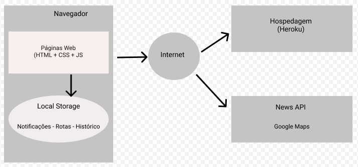
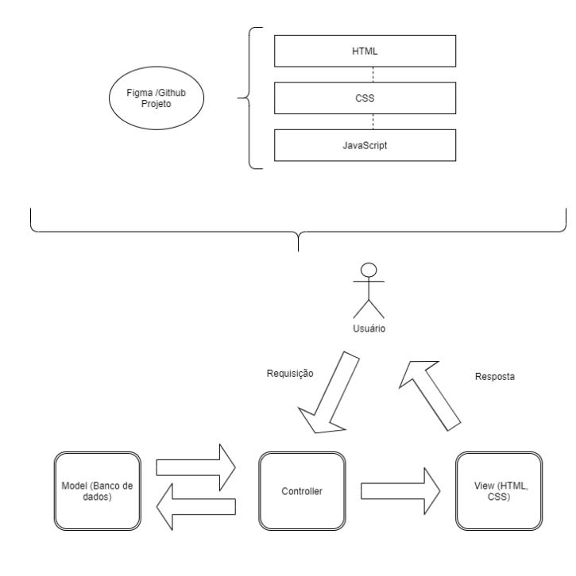

# Arquitetura da Solução

Pré-requisitos: <a href="3-Projeto de Interface.md"> Projeto de Interface</a>

Definição de como o software é estruturado em termos dos componentes que fazem parte da solução e do ambiente de hospedagem da aplicação.

## Diagrama de componentes

Diagrama que permite a modelagem física de um sistema, através da visão dos seus componentes e relacionamentos entre os mesmos.

Exemplo: 

Os componentes que fazem parte da solução são apresentados na Figura XX.

Figura XX - Arquitetura da Solução

A solução implementada conta com os seguintes módulos:
- **Navegador** - Interface básica do sistema  
  - **Páginas Web** - Conjunto de arquivos HTML, CSS, JavaScript e imagens que implementam as funcionalidades do sistema.
   - **Local Storage** - armazenamento mantido no Navegador, onde são implementados bancos de dados baseados em JSON. São eles: 
     - **Notificações** - Notificações feitas e a fazer 
     - **Rotas** - Rotas otimizadas
     - **Histórico** - Histórico de atividades
 - **News API** - Google Maps (https://www.google.com.br/maps)
 - **Hospedagem** - Heroku
 

## Tecnologias Utilizadas

As tecnologias utilizadas para a aplicação Notfy são:
- GitHub e GitHub Desktop;
- Linguagens: HTML, CSS, JavaScript;
- Heroku;
- Visual Studio Code;
- Automated Kanban;
- Figma.

Padrão de arquitetura  - MVC

O HTML será utilizado pra estruturação dos elementos da página em conjunto com CSS para personalização e estilização.

Por se tratar apenas de front end, nesta etapa, usaremos Javascript para validação de dados cadastrais. Posteriormente, o deploy da aplicação será feito através do Heroku.

## Hospedagem

Para hospedagem o site vai utilizar a plataforma Heroku como ambiente do projeto Notfy. A URL onde o site é mantido está disponível em: https://notfy.herokuapp.com
